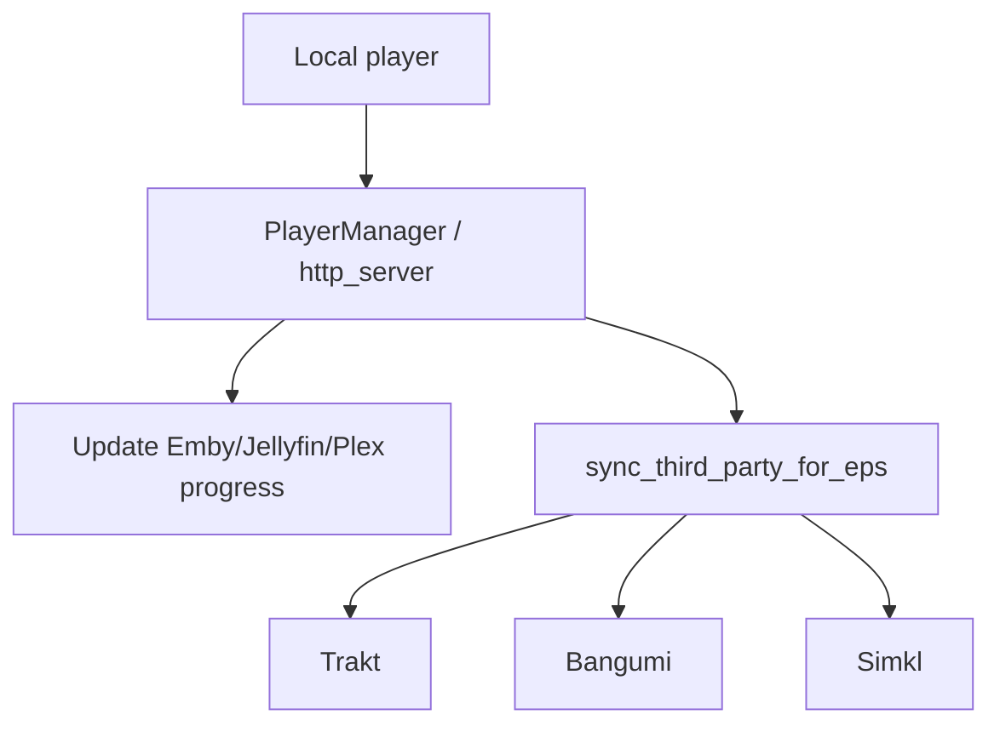
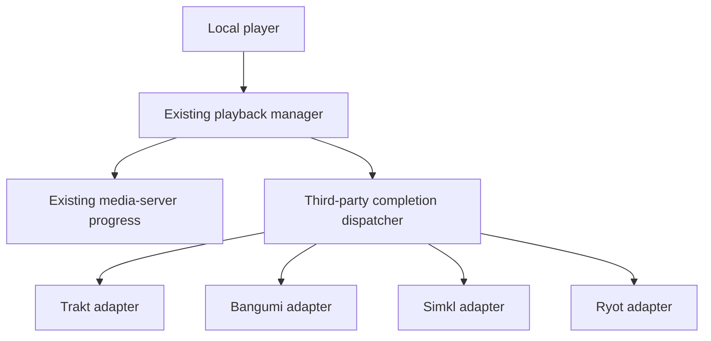

# Architecture

## Baseline

Fork baseline: `kjtsune/embyToLocalPlayer` `main` at `0554fd9c8b6759f41448927f4fdf4922d1f54ce3`.

## Current playback and tracking path

Code audit shows two separate responsibilities that should remain separate.

### Media-server playback reporting

`PlayerManager.update_playback_for_eps()` and the non-playlist path in `http_server.py` calculate the final playback position and call `update_server_playback_progress`. This is the authoritative Emby/Jellyfin/Plex playback-report path.

### Third-party completion sync

After server progress is updated, enabled providers are dispatched through `sync_third_party_for_eps` in `utils/net_tools.py`.

Current provider flow:



`sync_third_party_for_eps` currently:

- filters by provider `enable_host`;
- skips an item already synchronized by that provider during the current process;
- selects items only when `_stop_sec / total_sec > 0.9`;
- invokes the provider-specific sync function.

The provider set is currently hard-coded in several loops and dictionaries (`trakt`, `bangumi`, `simkl`). Ryot will initially be added with the smallest safe change to those dispatch points.

## Target S1/S2 shape



Do not refactor the player core merely to make the provider architecture look cleaner.

## Provider abstraction strategy

The current repository is small enough that a formal interface hierarchy is not required in S1. Prefer an incremental path:

1. Add `utils/ryot_api.py` and/or `utils/ryot_sync.py` only after the S1 API contract is verified.
2. Add Ryot to existing provider dispatch in a reviewable diff.
3. If the fourth provider makes repeated dispatch logic error-prone, extract a registry in a follow-up refactor with tests.

A future registry could map provider names to test/sync functions, but it is not an S0 requirement.

## Media identity

ETLP already receives rich media-server item data including `ProviderIds`, `Type`, series/season/episode information and playback duration. Ryot integration should normalize this into a provider-neutral payload before network calls:

```text
MediaIdentity
- type: movie | episode
- tmdbId?
- tvdbId?
- imdbId?
- series tmdb/tvdb/imdb IDs when available
- season?
- episode?
- title (diagnostic only)
```

Do not use filenames or localized titles as the primary identity when stable provider IDs exist.

## Playback milestones

- **S2:** completed-item sync using the existing >90% path.
- **S3:** optional in-progress reporting using trustworthy player position events.
- **Later:** pause/resume/start/end only if Ryot benefits from them and player support is consistent enough.

This ordering keeps the first implementation independent of fragile real-time player IPC differences.
